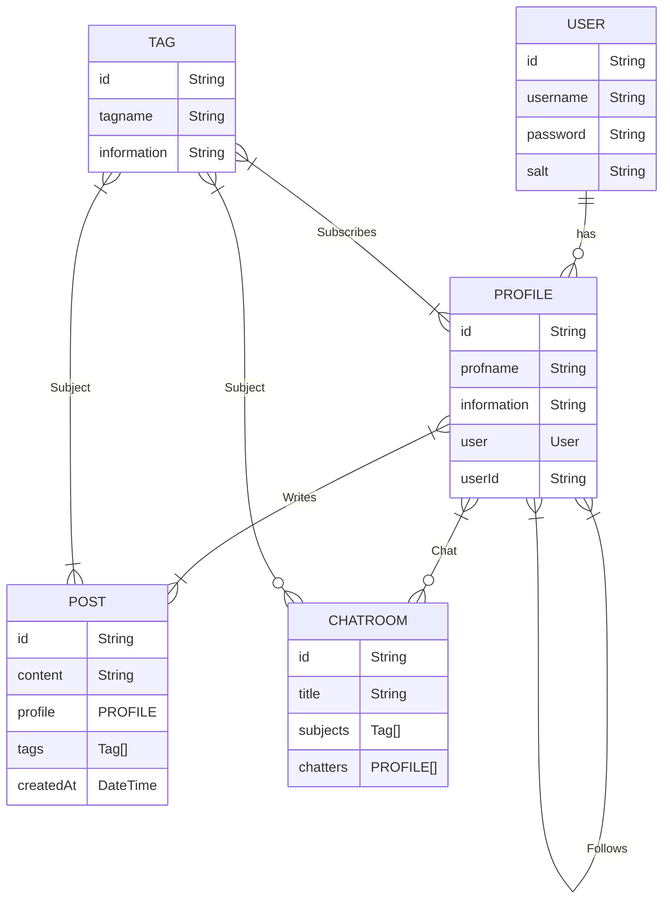

# 여기 여기 붙어라 👍

- [여기 여기 붙어라 👍](#여기-여기-붙어라-)
  - [1. 프로젝트 소개](#1-프로젝트-소개)
  - [2. 프로젝트 기술 스택](#2-프로젝트-기술-스택)
  - [3. ERD](#3-erd)
  - [4. API](#4-api)
  - [5. 프로젝트 저장소](#5-프로젝트-저장소)

## 1. 프로젝트 소개

아이돌 좋아하는 사람! 게임 좋아하는 사람! 만화 좋아하는 사람! 여기 여기 붙어라! 여기 여기 붙어라 는 좋아하는 관심사를 선택하여 관심사가 같은 사람들끼리 서로 소통하면서 유대감을 쌓고 정보를 공유할 수 있도록 태그 기능을 부각시킨 SNS/커뮤니티 사이트입니다.

## 2. 프로젝트 기술 스택

- Language
  - [TypeScript](https://www.typescriptlang.org/)
- DB
  - [Prisma ORM](https://www.prisma.io/)
  - [PlanetScale](https://planetscale.com/)
- FE
  - [React](https://reactjs.org/)
  - [Next.js](https://nextjs.org/)
  - [Material UI](https://material-ui.com/)
- BE
  - [nest.js](https://nestjs.com/)
  - [Swagger](https://swagger.io/)
  - [passport.js](http://www.passportjs.org/)
  - [socket.io](https://socket.io/)

## 3. ERD

## 4. API

| Path                                      | Method | Description                                                        |
| ----------------------------------------- | ------ | ------------------------------------------------------------------ |
| /login                                    | POST   | 로그인                                                             |
| /signup                                   | POST   | 회원가입                                                           |
| /profiles                                 | GET    | 현재 로그인된 유저의 모든 프로필 조회                              |
| /profiles                                 | POST   | 현재 로그인된 유저의 프로필 생성                                   |
| /profiles                                 | PATCH  | 현재 로그인된 프로필의 정보 수정                                   |
| /profiles/famous?cursor=[cursor?]         | GET    | 구독 수가 많은 순서대로 정렬된 프로필 조회                         |
| /profiles/as/[id]                         | GET    | ID id 프로필로 접속                                                |
| /profiles/[id]                            | GET    | ID id 프로필의 정보                                                |
| /profiles/[id]/posts?cursor=[cursor?]     | GET    | ID id 프로필이 작성한 글                                           |
| /profiles/[id]/tags?cursor=[cursor?]      | GET    | ID id 프로필이 구독하는 태그                                       |
| /profiles/[id]/follows?cursor=[cursor?]   | GET    | ID id 프로필이 구독하는 프로필                                     |
| /profiles/[id]/followers?cursor=[cursor?] | GET    | ID id 프로필을 구독하는 프로필                                     |
| /profiles/[id]/follow                     | GET    | 현재 로그인된 프로필이 ID id 프로필 구독                           |
| /feed                                     | GET    | 프로필의 피드 조회                                                 |
| /posts                                    | GET    | 프로필이 구독한 태그가 달리거나 구독한 프로필들이 작성한 글을 조회 |
| /posts                                    | POST   | 프로필이 글을 작성                                                 |
| /posts/search                             | POST   | 제목에 q 키워드가 포함되고 tags 태그들이 포함된 글 조회            |
| /chats                                    | GET    | 사용자가 들어간 채팅방 조회                                        |
| /chats                                    | POST   | 채팅방 개설                                                        |
| /chats/search                             | GET    | 제목에 q 키워드가 포함되고 tags 태그들이 포함된 채팅방 조회        |
| /chats/[id]                               | GET    | ID id 채팅방 입장                                                  |
| /chats/[id]                               | DELETE | ID id 채팅방 퇴장                                                  |
| /tags                                     | GET    | 사용자가 구독한 태그 조회                                          |
| /tags                                     | POST   | 사용자의 구독에 tag 태그 추가                                      |
| /tags                                     | DELETE | 사용자의 구독에 tag 태그 제거                                      |
| /tags/search                              | GET    | q 키워드가 포함된 태그 조회                                        |
| /tag/[id]                                 | GET    | ID id 태그 정보 조회                                               |
| /tag/[id]/posts                           | GET    | ID id 태그가 달린 포스트 조회                                      |
| /tag/[id]/chats                           | GET    | ID id 태그가 달린 채팅방을 조회                                    |
| /tag/[id]/profiles                        | GET    | ID id 태그를 구독한 프로필을 조회                                  |

## 5. 프로젝트 저장소

[FE](https://github.com/2chanhaeng/codingon-kdt-web7-team3-fe)
[BE](https://github.com/2chanhaeng/codingon-kdt-web7-team3-be)
